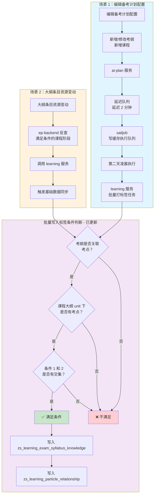

# 📊 备考计划流程图（已更新）

**更新时间**：2026-03-26  
**更新内容**：移除"考纲和课程科目一致"的限制

---

## 📋 完整流程图



---

## 🔄 批量写入条件（更新后）

| 序号 | 条件 | 状态 | 说明 |
|------|------|------|------|
| 1 | 考纲关联了考点 | ✅ | 考纲必须有对应的考点 |
| 2 | 课程大纲 unit 下有考点 | ✅ | 查询 `resource_knowledge`，更新至 `zs_learning_module.knowledge_point_ids` |
| 3 | 条件 1 和 2 有交集 | ✅ | 考纲考点与课程考点有重叠 |

**移除的条件**：
- ❌ ~~考纲和课程科目一致~~ （已移除，不再限制）

---

## 🔗 在线查看/导出 PNG

```
https://mermaid.live/edit#pako:eNpdkstuwjAQRX_F8hpJkLh5SN2wqLoC2bRdIC8Qq7GHPg4Q8e87gUCh68SZe89cT0g4kBUhG3hYQ5h3hH4O3sN4C1Gz7jR00Bq4o4a3jg226059B73mPbQGHmnmveOD7bpT38GgRQ9tAYOmHbQGHmnuveOD7bpT38GoeQ9tAYOmHbQGHmnuveOD7bpT38GkeQ9tAYOmHbQGHmnuveOD7bpT38GseQ9tAYOmHbQGHmnuveOD7bpT38GieQ9tAYOmHbQGHmnuveOD7bpT38GqeQ9tAYOmHbQGHmnuveOD7bpT38GmeQ9tAYOmHbQGHmnuveOD7bpT38GueQ9tAYOmHbQGHmnuveOD7bpT38GheQ9tAYOmHbQGHmnuveOD7bpT38GpeQ9tAYOmHbQGHmnuveOD7bpT38G1eQ9tAYOmHbQGHmnuveOD7bpT38G9eQ9tAYOmHbQGHmnuveOD7bpT38GjeQ9tAYOmHbQGHmnuveOD7bpT38GzeQ9tAYOmHbQGHmnuveOD7bpT38GLeQ9tAYOmHbQGHmnuveOD7bpT38GbeQ9tAYOmHbQGHmnuveOD7bpT38GneQ9tAYOmHbQGHmnuveOD7bpT38GveQ9tAYOmHbQGHmnuveOD7bpT38GweQ9tAYOmHbQGHmnuveOD7bpT38G4eQ9tAYOmHbQGHmnuveOD7bpT38G4eQ9tAYOmHbQGHmnuveOD7bpT38HDeQ9tAYOmHbQGHmnuveOD7bpT38HLeQ9tAYOmHbQGHmnuveOD7bpT38HfeQ9tAYOmHbQGHmnuveOD7bpT38HoeQ9tAYOmHbQGHmnuveOD7bpT38HweQ9tAYOmHbQGHmnuveOD7bpT38H4eQ9tAYOmHbQGHmnuveOD7bpT38H8eQ9tAYOmHbQGHmnuveOD7bpT38E
```

**操作步骤**：
1. 点击上面的链接
2. 在右侧点击 **"Actions"**
3. 选择 **"Export PNG"** 或 **"Export SVG"**

---

## 📊 影响分析

### 更新前
- 4 个条件全部满足才能写入
- 部分跨科目但考点相关的考纲 - 课程组合被排除

### 更新后
- 仅需 3 个条件
- **跨科目的考纲 - 课程组合现在可以触发同步**
- 接口调用次数可能增加

### 示例

**场景**：某课程包含多个科目（如综合试卷）

| 考纲科目 | 课程科目 | 更新前 | 更新后 |
|---------|---------|--------|--------|
| 数学 | 数学 | ✅ 可写入 | ✅ 可写入 |
| 数学 | 英语 | ❌ 不可写入 | ✅ **可写入**（如有考点交集） |
| 综合 | 数学 | ❌ 不可写入 | ✅ **可写入**（如有考点交集） |

---

*文档更新时间：2026-03-26 11:30*
