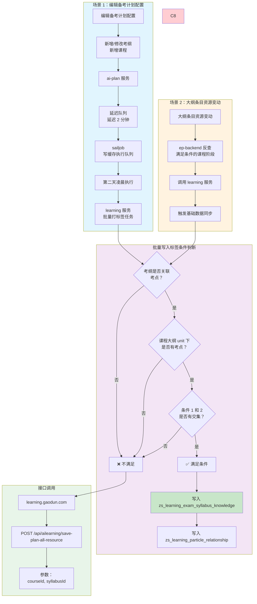
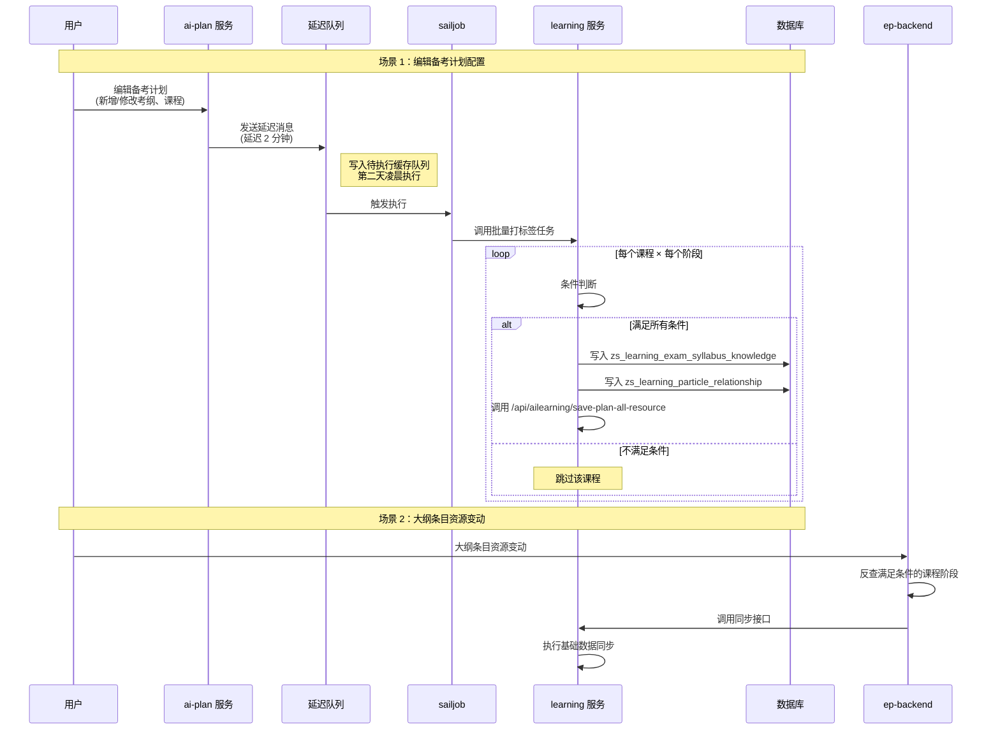
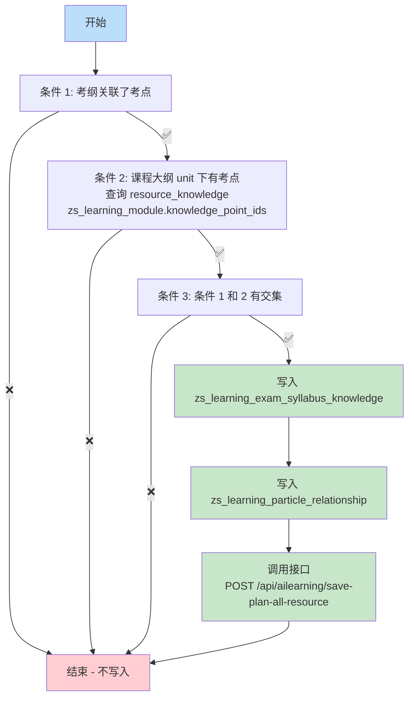
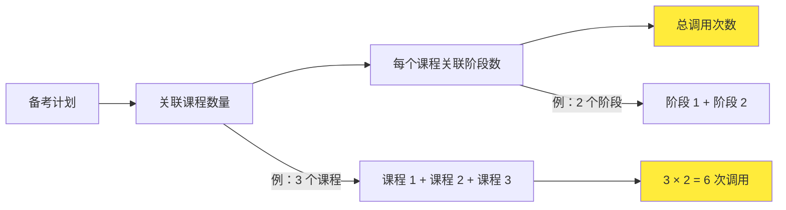

# 备考计划基础数据同步流程

## 📊 完整流程图



---

## 🔄 时序图



---

## 📋 条件判断详细流程（更新后）



---

## 📊 接口调用次数计算



**计算公式**：
```
总调用次数 = 课程数量 × 每个课程的阶段数量
```

**示例**：
- 3 个课程 × 2 个阶段 = **6 次接口调用**
- 5 个课程 × 3 个阶段 = **15 次接口调用**

---

## 🔧 接口详情

| 项目 | 详情 |
|------|------|
| **服务** | learning.gaodun.com |
| **方法** | POST |
| **URL** | `/api/ailearning/save-plan-all-resource` |
| **参数** | `{"courseId": 91784, "syllabusId": 175030}` |

---

## 📝 数据表说明

| 表名 | 说明 |
|------|------|
| `zs_learning_exam_syllabus_knowledge` | 考纲 - 考点关联表 |
| `zs_learning_particle_relationship` | 知识点关系表 |
| `resource_knowledge` | 资源 - 知识点关联表 |
| `zs_learning_module` | 学习模块表（含 knowledge_point_ids） |

---

## 🔄 更新说明

**2026-03-26 更新**：移除了"考纲和课程科目一致"的限制条件

### 更新前（4 个条件）
1. ❌ ~~考纲和课程科目一致~~ **（已移除）**
2. ✅ 考纲关联了考点
3. ✅ 课程大纲 unit 下有考点
4. ✅ 条件 2 和 3 有交集

### 更新后（3 个条件）
1. ✅ 考纲关联了考点
2. ✅ 课程大纲 unit 下有考点
3. ✅ 条件 1 和 2 有交集

**影响**：更多考纲 - 课程组合可以满足条件，触发批量写入标签

---

## ⏰ 执行时间线

```mermaid
gantt
    title 备考计划同步执行时间线
    dateFormat HH:mm
    axisFormat %H:%M
    
    section 场景 1
    编辑备考计划 :done, edit, 10:00, 2m
    延迟队列等待 :active, delay, 10:02, 2m
    写入缓存队列 :crit, cache, 10:04, 1m
    第二天凌晨执行 :crit, exec, 02:00, 30m
    
    section 场景 2
    大纲资源变动 :done, change, 11:00, 1m
    实时同步 :active, sync, 11:01, 5m
```



---

*文档生成时间：2026-03-26*
